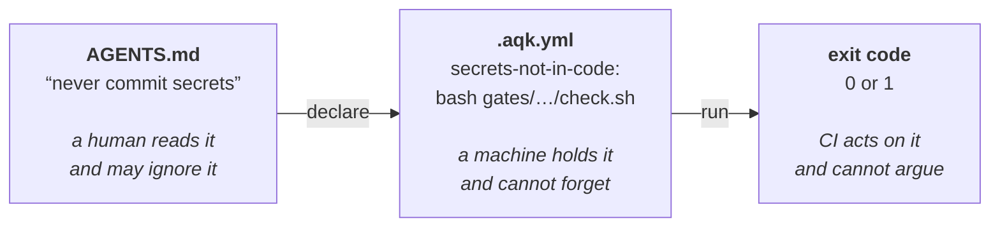
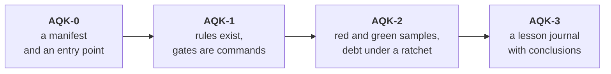

# AQK — Agent Quality Kit

**English** · [Русский](README.ru.md)

[](https://www.npmjs.com/package/agent-quality-kit)
[](https://github.com/arsen-ask-lx/Agent_Quality_Kit/actions/workflows/ci.yml)
[](LICENSE)
[](https://github.com/arsen-ask-lx/Agent_Quality_Kit)

**Check whether a repository is ready to have its code written by AI coding agents — and turn
the rules it promises to follow into commands with exit codes.**

Your `AGENTS.md` says what the project promises. Nothing checks that those promises are true, or
that the commands it lists even run. AQK is that missing layer: one command reads the repository,
reports a level from AQK-0 to AQK-3, and names every guard that is missing.

```bash
npx agent-quality-kit doctor    # code already exists: your level and what to install
npx agent-quality-kit start     # no code yet: day-zero guards, right away
```

`doctor` only reads. It writes no file and sends nothing anywhere — safe to point at a repository
you have decided nothing about yet. Nothing to install: `npx` fetches the package (230 KB).

### Works with any agent, any language

**Any agent.** Claude Code, Codex, Cursor, Gemini CLI, GitHub Copilot, Windsurf, Aider, OpenCode
— and with no AI at all. AQK reads and writes plain files (`AGENTS.md`, `.aqk.yml`); it calls no
vendor API, needs no key, and is tied to no model. A promise only one tool can keep is not a
promise.

**Any language.** The portable checks are plain `sh` and work on any stack — Python, TypeScript,
Go, Rust, Java, Ruby, PHP, C#, Kotlin, Swift, Scala. Where the project already has a native tool
(`ruff`, `eslint`, `knip`, `jscpd`), the check uses it instead, because it is more precise — and
says so out loud when it falls back.

**Requirements:** Node 18+ and an `sh` shell. Present on macOS, Linux and WSL; Git Bash on Windows.

### One movement, and everything follows from it



A promise the project makes turns into a command with an exit code. From then on a machine holds
it, not somebody's attention.

What a project needs before that is even possible, in plain words, independent of language and
tooling: [the dark factory and the minimum that isn't optional](kit/docs/ai/project-baseline.md).

```
 █████╗   ██████╗ ██╗  ██╗
██╔══██╗ ██╔═══██╗██║ ██╔╝
███████║ ██║   ██║█████╔╝
██╔══██║ ██║▄▄ ██║██╔═██╗
██║  ██║ ╚██████╔╝██║  ██╗
╚═╝  ╚═╝  ╚══▀▀═╝ ╚═╝  ╚═╝
   a promise without an exit code is just a sentence
```

## Every command

```
aqk doctor              what this repository is at, and what is missing
aqk doctor --run        run every gate the manifest declares
aqk doctor --run --since main    only what the diff introduced
aqk doctor --run --min 1         fail a pipeline below a level
aqk doctor --baseline   the minimum a project needs, confirmed by a run

aqk init                lay the kit into an existing repository
aqk start               start a new project from the kit
aqk add <name>          install one guard from the catalogue
aqk new <name>          scaffold a guard of your own
aqk find <text>         find a guard by intent
aqk why <name>          what failure this guard was written for

aqk prove               run every declared gate against its own samples:
                        red on the red one, quiet on the green one
aqk report              the report form, assembled by a run
aqk report --since main  ...plus what proves this diff, file by file
aqk badge               write the level badge into the README
aqk badge --check       fail if the badge disagrees with a run

aqk context             the repository state in one block, for an agent's context:
                        level, what is red now, rules nobody enforces, ratchets
aqk context --full      the same plus the command map and the rulebook verbatim (~7000
                        tokens against ~375: the price of an agent that does not guess)
aqk context --install   put a SessionStart hook into .claude/settings.json
                        (add --full to install the full block)

aqk learn               rule candidates from local transcripts:
                        said out loud, never written down
aqk note "..."          write a bruise into the journal
aqk ratchet <name>      a debt registry for a declared gate: may only get shorter
aqk blob                every guide as a single file
```

Exit codes: `0` pass, `1` below the level or a gate failed. Two exceptions, both deliberate:
`learn` never fails a build — it reads transcripts and prints to the terminal only, writing
nothing. And `--baseline` is an inspection, not a run: it always exits `0`, so combining it with
`--run` or `--min` is refused outright rather than handing you a pipeline that cannot go red.

## What this looks like

Someone else's project, three files, nothing configured:

```console
$ npx agent-quality-kit start        # installs the guards and declares them in the manifest
$ npx agent-quality-kit doctor --run # runs them

  ✘  secrets-not-in-code   exit 1
        ./src/api/mailer.py:1:API_KEY = "sk_live_51Hxx…"
          fix: take the value out of the file, put it in an environment variable
          and revoke the old key. it cannot be scrubbed from history any more.
  ✘  swallowed-error       exit 1
        ./src/api/mailer.py:7: caught and dropped — except Exception:
          fix: either handle it and log it, or re-raise.
  ✘  no-print-in-prod      exit 1
        ./src/web/app.js:3:  console.log("debug", x);
        ./src/api/mailer.py:8:    print("sent", to)
  ✘  todo-without-task     exit 1
        ./src/web/app.js:1:// TODO: rewrite this
  ✔  file-size-limit · entry-links-exist · complexity-limit
```

The failure text is written for an agent: it says **what exactly to do**. The exit code is for
your pipeline. Not one finding inside the kit's own samples: the native tool runs through the
same filter as the portable check.

**Requirements.** Node 18+ and an `sh` shell — present on macOS, Linux and WSL; Git Bash works on
Windows. The portable checks are written in `sh` on purpose: it exists everywhere code is built.

**Tool-agnostic:** Claude Code, Codex, Cursor — and without AI at all.

The first time you run `init`/`start` on a machine, it prints a link to star the repo and to open
an issue, once. Nothing is posted anywhere — it is text for a human, and it never repeats.

**Off-the-shelf rules are optional and installed separately.** The portable check always works
without them; if the project already has `ruff`, `eslint` or `vulture`, the entry will use the
native rule instead — it is more precise. One entry, `dead-code`, does not work at all without a
real tool and honestly hides itself: you cannot build a call graph with a text search.

## What this is not

| Looks like | The difference |
|---|---|
| **a linter** (`ruff`, `eslint`) | AQK does not replace them, it **uses** them: if the tool is on the system, the entry takes its rule — it is more precise. A linter answers "this code is clean"; AQK answers "in this repository, this particular promise is held by a machine, and here is the proof" |
| **`pre-commit` and hooks** | they run checks. AQK answers a different question: which checks exist here at all, whether they work, and what this project has already been burned by — machine-readably, for an agent, a pipeline and a newcomer |
| **a checklist or an awesome list** | an entry is accepted only if it names a **real failure** it caught, and its arbiter goes red on the red sample and stays quiet on the green one. A machine checks that, not a reviewer |
| **a repository scorecard** (compliance badges) | they measure maturity and hand out a grade. The AQK level measures how **machine-readable** your practice is, and says outright that it is not a verdict on the project: a hundred working checks with no manifest is AQK-0 |

In one sentence: **a promise the project makes turns into a command with an exit code, and from
then on a machine holds it, not somebody's attention.**

## How it works

The whole standard is one `.aqk.yml` file in the repository root:

```yaml
aqk: 1
entry:  [AGENTS.md]        # what the agent reads first
rules:  .aqk/rules         # where the standards live
docs:   .aqk/docs          # where the guides live (optional; this is the default)
gates:                     # what must pass — as commands, not as prose
  lint: "npm run lint"
  secrets-not-in-code: "bash gates/secrets-not-in-code/check.sh ."
samples:  gates            # a red and a green sample for every entry
ratchets: ratchets         # debt registries: the list may only get shorter
lessons:  incidents        # where lessons accumulate
```

An empty field is not a placeholder — it is an honest "this level is not reached". `init` writes
them empty, and they fill in as there becomes something real to put in them.

**If a claim cannot be checked by a machine, it is not in this standard.** Otherwise the badge
would mean trust in the author rather than a fact.

### The minimum a project needs

```bash
aqk doctor --baseline   # ✔/✘ over the points a machine can confirm
```

The guide [project-baseline.md](kit/docs/ai/project-baseline.md) lists 50 points a project needs
before the work can be handed to agents. Fourteen of them a machine can confirm from the
repository — a lockfile of any ecosystem, a linter config of any language, an error tracker in
the dependencies, a pipeline, tests. It says what proved each one. The remaining 36 are named as
a number rather than hidden: they are for your eyes.

Presence is what gets checked, not whether it works: "a linter is configured" and "a linter
catches things" are different claims, and the output says so out loud.

## Four levels

| Level | Required | What it proves |
|---|---|---|
| **AQK-0** | a manifest and an entry point | the tooling knows what to read |
| **AQK-1** | rules exist, gates declared as commands | the checks are executable |
| **AQK-2** | gates have red and green samples, debt under a ratchet | the gate catches defects and stays quiet on correct code |
| **AQK-3** | a lesson journal with conclusions | the same bruise is not collected twice |



A level is not a verdict on the project — it measures how **machine-readable** the practice is.
A hundred working checks with no manifest is AQK-0, and that is honest: nothing can read them.

```bash
aqk doctor --run --min 1   # in CI: fails below AQK-1 OR if any gate failed
```

## The badge

```bash
aqk badge          # runs the declared gates, prints the markdown — only if every one is green
aqk badge --check  # in CI: exit 1 the day the badge in your README stops matching the run
```

A badge nobody re-computes is a claim, not a fact — which is the very thing this project
replaces. So `aqk badge` prints nothing over a red gate, and `aqk badge --check` fails your
pipeline on the day the README and the repository part ways. The badge at the top of this file
is checked that way on every push.

## As a pre-commit hook

Already using [pre-commit](https://pre-commit.com)? Three lines in the file you already have:

```yaml
repos:
  - repo: https://github.com/arsen-ask-lx/Agent_Quality_Kit
    rev: v0.7.0
    hooks:
      - id: aqk            # runs what the repository declares; blocks below AQK-1
      # - id: aqk-doctor   # read-only: the level and what is missing, blocks nothing
      # - id: aqk-baseline # the minimum a project needs, confirmed by a run
```

`pre-commit` installs the package itself — there is nothing else to set up, and the package has
no dependencies.

**This does not replace pre-commit, it sits on top of it.** pre-commit runs checks; it says
nothing about *which* checks exist here, whether they work, and what this project has already
been burned by. Its own documentation is explicit about both gaps: no built-in compliance levels,
scoring or reporting — and it does not verify that a hook catches what it claims. That is the
layer AQK adds.

## In your pipeline

[](https://github.com/marketplace/actions/agent-quality-kit-aqk)

```yaml
- uses: arsen-ask-lx/Agent_Quality_Kit@v0.7.0
  with:
    min: 1   # the build fails below AQK-1, or if any declared gate failed
```

The action is a thin wrapper around one command and holds no logic of its own — without it,
the same thing in a single line:

```yaml
- run: npx agent-quality-kit doctor --run --min 1
```

## Installing a gate

```bash
aqk find "print statements in production"   # is there already such a gate — matched by intent
aqk doctor                                  # what applies to this repository and what is missing
aqk add secrets-not-in-code                 # copies the check and its samples in, declares it
aqk doctor --run                            # runs the declared gates and shows the result
aqk doctor --run --since main               # ... but only what the diff introduced
aqk ratchet no-print-in-prod                # existing violations become debt, new ones are blocked
```

### The first run on a real project

An established repository carries years of debt. Run every gate over all of it and you get a wall
of red that nobody reads — so the tool gets switched off. `--since <ref>` narrows the output to
files the diff touched:

```bash
aqk doctor --run --since main    # only what this branch introduced
```

Three outcomes, all of them said out loud. Findings inside the diff — red, as usual. Findings only
outside it — green, with the number that was hidden, never a silent "all clear". And a gate whose
output carries no paths at all (a commit-message check, a CI-config check) **cannot** be narrowed:
it stays red, and says why. Calling it green because there was nothing to narrow would be exactly
the silence this tool exists to remove.

Every `doctor --run` rewrites `.aqk/last-run.md` — a short report of what actually ran and how
long it took. The list of gates in the manifest says nothing about how many of them are alive
right now; the report does. The file is ephemeral — keep it in your own `.gitignore`.

### Introducing a rule into a live project

Three ways, and each has a price. A big clean-up is put off forever because it is big. The
ratchet turns existing violations into debt and blocks new ones — right once the rule is agreed.
And while it is still being argued about, an advisory gate shows findings without failing the run:

```yaml
advisory:
  - complexity-limit
```

Declared in the manifest, not passed as a flag. A flag that says "fail nothing" downgrades every
check at once, is invisible in the diff, and is never named in the summary — that is
`continue-on-error`, which this tool marks red elsewhere. The list is printed on **every** run:
an advisory gate everyone forgot about is a switched-off check.

## When a bug slips past the guards

```bash
aqk why "a file grew to nine thousand lines"
```

The answer is one of three, and it is chosen by an actual run rather than by memory: **there was
no guard** · **the guard exists but does not see this failure** · **the guard exists and catches
it — so it was bypassed**. The difference decides what to fix: the check itself, or its place in
the pipeline. Without a run those two are indistinguishable, and people usually fix the wrong
one. On an uncertain match the command asks instead of choosing for you.

**The ratchet** is for introducing a rule into a project whose existing code violates it. The
violations are captured into a registry; the gate lets that list get **shorter** and refuses to
let it grow. The rule applies from the day it is installed — the old code stays untouched.

`add` **copies the check into your repository** rather than referencing the package: installed
via `npx` the package is temporary, and tomorrow the command in your manifest would point at
nothing.

## Third-party code inside the repository

A reference copy, vendored code, generated clients — code that lives here but was not written
here. The scanning checks will skip it if you add `.aqkignore` in the root: one pattern per line,
`#` starts a comment, and `*` does not cross `/`.

```
# brought in from another repository
third-party/
vendor/
*.generated.js
```

`aqk report` prints the contents of this file as its own section. Hiding things silently is the
same class as a silent gate: a line here means there is no protection along that path, and will
not be.

## The catalogue of promises

`doctor` inspects the repository — languages, existing gates — and shows **only what applies**:
what a machine already holds, what applies but is not installed, and what is hidden and why. The
catalogue may grow to hundreds of entries; a given project still sees about a dozen.

An entry is accepted only if its arbiter goes red on the red sample, stays quiet on the green
one, and names a real failure it caught. A machine checks this: `bash tool/selfcheck/gates.sh`.

### Four entries that watch the agent, not the code

Ruff, ESLint and gitleaks already find bad code, and AQK calls them where it can rather than
reinventing them. These four look elsewhere — at the moment the **signal** about bad code is
switched off, which is what a coding agent does when the task is phrased as "make it pass":

| Entry | What it catches |
|---|---|
| `gate-not-weakened` | the fix was a suppression, not a fix: bare `# noqa`, `eslint-disable` with no rule named, `@ts-ignore`, `--no-verify` |
| `ci-actually-fails` | a pipeline step that renders a verdict but cannot fail — `run: pytest \|\| true`, `continue-on-error: true` |
| `test-has-assertion` | a test that cannot fail: empty body, `assert True`, a skip with no reason given |
| `promise-has-gate` | a rule in `AGENTS.md` with no enforcer named — neither a gate nor, honestly, a human |

Each was measured on nineteen third-party repositories (~25 000 files) before it entered the
catalogue, and two further entries were **cancelled by that measurement**: one because
[`agents-lint`](https://github.com/giacomo/agents-lint) already does it better, one because
91 of its 120 findings turned out to be a legitimate pattern.

## The guides as a single file

```bash
aqk blob     # assembles GOD_AI.md out of kit/docs — to hand the guides to a chat in one go
```

The file is **assembled, not stored**: edit the originals. A hand-edited copy drifts from its
source within a week, and then nobody knows which one is real.

## Contributing a gate

The catalogue lives on other people's bruises. The procedure and the bar are in
[`CONTRIBUTING.md`](CONTRIBUTING.md): check for duplicates with `aqk find`, scaffold with
`aqk new`, add two samples, fill in four fields, run the machine. The filtering is done by
`tool/selfcheck/gates.sh`, not by a reviewer.

## The bruise journal

```bash
aqk note "the gate went red on correct code"   # an entry without a conclusion is rejected
```

## Honestly, where this stands

The full brief is in [`PROJECT.md`](PROJECT.md) (in Russian): what is being built, the four
scenarios, the success criterion, and what is left.

Version 1, one author. The kit holds **AQK-3** on itself: everything declared is executed by CI
on every push, two debt registries under a ratchet — `node tool/program.mjs doctor --run --min 1`.
As long as one person uses it, AQK is a nice acronym in a README. It starts being real when a
third, foreign project appears.

**A standard cannot be shipped first.** A specification ahead of practice is the thirty-first
abandoned repository with a manifest and zero users. The order is the other way round:

| # | Step | State |
|---|---|---|
| 1 | live by this on our own projects | ⬜ measured: three of our own projects have no manifest |
| 2 | `doctor` computes the level | ✅ done |
| 3 | what settled is written up as a short spec | ✅ [`SPEC.md`](SPEC.md) |
| 4 | a third project — **someone else's** | ❌ the first honest signal, still missing |
| 5 | badge, site, talking to people | ❌ only after step four |

## The work queue

Lives in one place — [`PROJECT.md` §9](PROJECT.md). It is not repeated here: two lists drift
apart within a month, and then nobody knows which is real.

What is missing: a second user; per-command coverage of the commands that write to disk (they are
exercised by a clean-folder run, but not individually); a third — foreign — project.

MIT.
