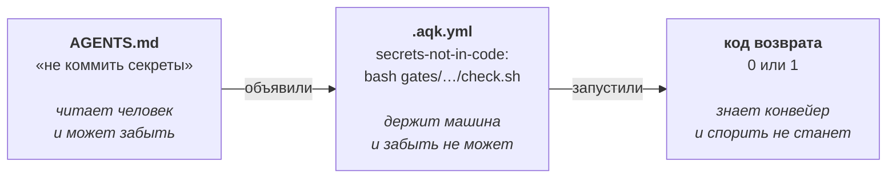
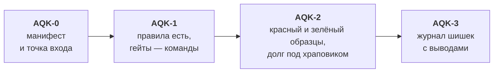

# AQK — Agent Quality Kit

[English](README.md) · **Русский**

[](https://www.npmjs.com/package/agent-quality-kit)
[](https://github.com/arsen-ask-lx/Agent_Quality_Kit/actions/workflows/ci.yml)
[](LICENSE)
[](https://github.com/arsen-ask-lx/Agent_Quality_Kit)

**Проверить, готов ли репозиторий к тому, что код в нём пишет ИИ-агент — и превратить правила,
которые проект обещает соблюдать, в команды с кодом возврата.**

`AGENTS.md` говорит, что проект обещает. Никто не проверяет, правда ли это и запускаются ли
вообще перечисленные там команды. AQK — тот самый недостающий слой: одна команда читает
репозиторий, называет ступень от AQK-0 до AQK-3 и перечисляет каждого недостающего сторожа.

И один шаг дальше, чем соседние инструменты: `probe` подсаживает заведомый дефект в копию вашего
проекта и смотрит, покраснеет ли **объявленная** защита. «Тесты есть» и «тесты ловят» — разные
утверждения, и оценки готовности меряют первое.

```bash
npx agent-quality-kit doctor    # код уже есть: уровень и что поставить
npx agent-quality-kit start     # кода ещё нет: сторожа дня 0 сразу
```

`doctor` только читает: ни одного файла не пишет и никуда ничего не отправляет — его можно
направить на репозиторий, о котором ещё ничего не решено. Ставить ничего не нужно, `npx` скачает
пакет сам (574.1 kB, замер 2026-09-10 — это число не сторожит никто, так что при случае
перемерьте).

Единственное исключение, и названо оно здесь именно потому, что единственное: с `--brief`
(так его запускают хуки) `doctor` спрашивает у реестра npm свою последнюю версию — **не чаще
раза в сутки и никогда в конвейере**, с таймаутом в три секунды, молча при любой ошибке и
не влияя на код возврата. Выключается `AQK_UPDATE=0`. Автообновления нет: инструмент,
который молча подменяет себя, стоя на воротах коммита, — ровно та дверь, которую комплект
учит закрывать.

### Работает с любым агентом и любым языком

**Любой агент.** Claude Code, Codex, Cursor, Gemini CLI, GitHub Copilot, Windsurf, Aider,
OpenCode — и вообще без ИИ. AQK читает и пишет обычные файлы (`AGENTS.md`, `.aqk.yml`), не
обращается ни к одному API вендора, не требует ключа и не привязан к модели. Обещание, которое
держит только один инструмент, — не обещание.

**Любой язык.** Переносимые проверки написаны на `sh` и работают на любом стеке — Python,
TypeScript, Go, Rust, Java, Ruby, PHP, C#, Kotlin, Swift, Scala. Там, где у проекта уже есть
родной инструмент (`ruff`, `eslint`, `knip`, `jscpd`), проверка берёт его — он точнее, — и вслух
сообщает, когда откатилась на переносимый.

**Требуется:** Node 18+ и оболочка `sh`. Есть на macOS, Linux и в WSL; на Windows — Git Bash.
На Windows гейты идут через Git Bash, даже если `bash` в PATH — заглушка WSL из `System32`:
он ищется рядом с `git.exe`; другой путь задаётся `AQK_BASH`.

### Одно движение, из которого следует всё остальное



Обещание проекта становится командой с кодом возврата. Дальше его держит машина, а не чьё-то
внимание.

Что вообще должно быть на проекте, чтобы это было возможно, — словами, без привязки к языку и
инструменту: [«тёмная фабрика» и обязательный минимум](kit/docs/ai/project-baseline.md).

```
 █████╗   ██████╗ ██╗  ██╗
██╔══██╗ ██╔═══██╗██║ ██╔╝
███████║ ██║   ██║█████╔╝
██╔══██║ ██║▄▄ ██║██╔═██╗
██║  ██║ ╚██████╔╝██║  ██╗
╚═╝  ╚═╝  ╚══▀▀═╝ ╚═╝  ╚═╝
   обещание без кода возврата — просто предложение
```

## Все команды

```
aqk doctor              где этот репозиторий и чего в нём не хватает
aqk doctor --run        прогнать все гейты, объявленные в манифесте
aqk doctor --run --since main    только то, что внёс диф
aqk doctor --run --min 1         уронить конвейер ниже ступени
aqk doctor --baseline   обязательный минимум проекта, подтверждённый прогоном

aqk init                разложить комплект в существующий репозиторий
aqk start               начать новый проект с комплектом
aqk add <имя>           поставить один гейт из каталога
aqk new <имя>           завести свой гейт по форме
aqk find <текст>        найти гейт по намерению
aqk why <имя>           какой отказ этот гейт поймал

aqk prove               прогнать каждый объявленный гейт по его образцам:
                        красный на красном, тишина на зелёном
aqk probe               чего объявленные проверки НЕ видят: подсадка брака
                        в файлы, горячие по истории починок
aqk report              форма отчёта, собранная прогоном
aqk report --since main  ...и чем доказан этот диф, файл за файлом
aqk badge               вписать значок уровня в README
aqk badge --check       упасть, если значок расходится с прогоном

aqk context             состояние репозитория одним блоком, для контекста агента:
                        уровень, что красное сейчас, правила без арбитра, храповики
aqk vitals              подключено ли то, чем комплект работает: инструменты, хуки, свежесть
aqk doctor --run --brief  одна строка на успехе, весь прогон при провале — для хуков
aqk context --full      то же плюс карта команд и свод правил дословно (≈7000 токенов
                        против ≈375 — плата за то, чтобы агент не догадывался)
aqk context --install   поставить хук SessionStart в .claude/settings.json
                        (с --full ставится полный блок)

aqk learn               кандидаты в правила из локальной переписки:
                        что сказано вслух и не записано
aqk note "..."          записать шишку в журнал
aqk ratchet <имя>       реестр долга для объявленного гейта: может только укорачиваться
aqk blob                все методички одним файлом
```

Коды возврата: `0` — прошло, `1` — ниже ступени или упал гейт. Два исключения, оба намеренные:
`learn` не роняет сборку никогда — он читает переписку и печатает только в терминал, не записывая
ничего. А `--baseline` — осмотр, а не прогон: он выходит с нулём всегда, поэтому вместе с `--run`
или `--min` он теперь отказывает вслух, а не выдаёт конвейер, который не может покраснеть.

## Что это выглядит так

Чужой проект, три файла, ничего не настроено:

```console
$ npx agent-quality-kit start        # ставит сторожей и объявляет их в манифесте
$ npx agent-quality-kit doctor --run # запускает их

  ✘  secrets-not-in-code   код 1
        ./src/api/mailer.py:1:API_KEY = "sk_live_51Hxx…"
          почини: убери значение из файла, положи его в переменную окружения
          и отзови старый ключ. из истории секрет уже не вычистить.
  ✘  swallowed-error       код 1
        ./src/api/mailer.py:7: перехват без обработки — except Exception:
          почини: либо обработай и запиши в лог, либо пробрось дальше.
  ✘  no-print-in-prod      код 1
        ./src/web/app.js:3:  console.log("debug", x);
        ./src/api/mailer.py:8:    print("sent", to)
  ✘  todo-without-task     код 1
        ./src/web/app.js:1:// TODO: переписать
  ✔  file-size-limit · entry-links-exist · complexity-limit
```

Текст отказа написан для агента: в нём сказано, **что именно сделать**. Код возврата — для
конвейера. Ни одной находки в самих образцах комплекта: родной инструмент запускается через
тот же фильтр, что и переносимая проверка.

**Что нужно.** Node 18+ и оболочка `sh` — она есть в macOS, Linux и WSL; на Windows подойдёт
Git Bash. Переносимые проверки написаны на `sh` намеренно: он есть везде, где собирают код.

**Не зависит от инструмента:** Claude Code, Codex, Cursor — и без ИИ тоже.

При первой установке на машине `init`/`start` один раз печатают ссылку на звезду и на «завести
Issue» — ничего не постится сама, только текст для человека, и больше не повторяется.

**Готовые правила ставятся отдельно и по желанию.** Переносимая проверка работает без них
всегда; если в проекте стоит `ruff`, `eslint` или `vulture`, запись возьмёт готовое правило —
оно точнее. Одна запись, `dead-code`, без готового инструмента не работает вовсе и честно
скрывается: граф вызовов поиском по тексту не построить.

## Чем это не является

| Похоже на | В чём разница |
|---|---|
| **линтер** (`ruff`, `eslint`) | AQK их не заменяет, а **берёт**: если инструмент есть в системе, запись возьмёт его правило — оно точнее. Линтер отвечает «этот код чист», AQK — «в этом репозитории такое-то обещание держит машина, и вот доказательство» |
| **`pre-commit` и хуки** | они запускают проверки. AQK отвечает на другой вопрос: какие проверки тут вообще есть, работают ли они и на чём здесь уже обжигались — машиночитаемо, для агента, конвейера и нового человека |
| **чек-лист или awesome-список** | пункт принимается, только если назван **реальный отказ**, который он поймал, и его арбитр краснеет на красном образце и молчит на зелёном. Проверяет это машина, а не рецензент |
| **скоринг репозитория** (значки соответствия) | они мерят зрелость и дают оценку. Уровень AQK мерит **машиночитаемость** практики и прямо говорит, что это не оценка проекта: сотня работающих проверок без манифеста — это AQK-0 |

Одно предложение: **обещание проекта превращается в команду с кодом возврата, и дальше его
держит машина, а не чья-то внимательность.**

## Как устроено

Весь стандарт — файл `.aqk.yml` в корне:

```yaml
aqk: 1
entry:  [AGENTS.md]        # что агент читает первым
rules:  .aqk/rules         # где стандарты
docs:   .aqk/docs          # где методички (необязательно, это и есть умолчание)
lang:   ru                 # язык вывода для ЭТОГО репозитория, поверх локали машины
gates:                     # что обязано пройти — командами, не словами
  lint: "npm run lint"
  secrets-not-in-code: "bash gates/secrets-not-in-code/check.sh ."
covers:                    # что уже держит объявленный гейт — в долг не пишется
  lint: [no-print-in-prod, swallowed-error]
samples:  gates            # красный и зелёный образец каждой записи
ratchets: ratchets         # реестры долга: список может только укорачиваться
probe: 100                 # раз во столько коммитов проба делается сама; 0 — не делать
lessons:  incidents        # где копятся уроки
```

Пустое поле — не заглушка, а честный ответ «ступень не пройдена»: `init` кладёт их пустыми,
а заполняются они по мере того, как появляется чем их заполнить.

**Если утверждение нельзя проверить машиной — его в стандарте нет.** Иначе значок означает
доверие к автору, а не факт.

### Обязательный минимум проекта

```bash
aqk doctor --baseline   # ✔/✘ по пунктам, которые машина может подтвердить
```

Методичка [project-baseline.md](kit/docs/ai/project-baseline.md) перечисляет 50 пунктов, без
которых работу нельзя отдать агентам. Четырнадцать из них машина подтверждает по репозиторию —
файл-замок любой экосистемы, конфиг линтера любого языка, трекер ошибок в зависимостях,
конвейер, тесты. И называет, чем именно подтвердила. Оставшиеся 36 названы числом, а не спрятаны:
они — глазами.

Проверяется НАЛИЧИЕ признака, а не то, что он работает: «линтер настроен» и «линтер ловит» —
разные утверждения, и вывод говорит это вслух.

## Четыре ступени

| Уровень | Требуется | Что доказано |
|---|---|---|
| **AQK-0** | манифест и точка входа | инструмент знает, что читать |
| **AQK-1** | правила есть, гейты объявлены командами | проверки исполняются |
| **AQK-2** | у гейтов красные и зелёные образцы, долг под храповиком | гейт ловит брак и молчит на исправном коде |
| **AQK-3** | журнал уроков с выводами | шишка не набивается дважды |



Ступень — не приговор проекту: она мерит, насколько практика **машиночитаема**. Сто работающих
проверок без манифеста — это AQK-0, и это честно: их никто не может прочитать.

```bash
aqk doctor --run --min 1   # в конвейере: ошибка, если ниже AQK-1 ИЛИ упал хоть один гейт
```

### Как гейт доказывается — устройство `prove`

Ступень AQK-2 и значок держатся на одной команде, поэтому она описана здесь целиком: первый
чужой пользователь споткнулся об неё трижды, и все три раза виновата была эта страница.

```bash
aqk prove
```

Для каждого гейта из `gates:` берутся его образцы — `<samples>/<имя>/red` и `/green` — и гейт
запускается по каждому. **Каталог подставляется на место ПОСЛЕДНЕГО слова команды:** рецепты
каталога пишутся как `… {dir}`, и при установке `{dir}` превращается в `.`. Обёртки снимаются
заранее: `ratchet.sh` (иначе реестр долга перепишется находками из образца) и `_native.sh`
(иначе фильтр спрячет ровно то, что образец обязан показать).

Вердикт у каждой записи один из трёх:

| Вердикт | Что значит |
|---|---|
| **доказан** | код ≠ 0 на `red/` и код 0 на `green/` |
| **не ловит** | промолчал на красном, либо покраснел на зелёном |
| **доказывать нечем** | и вот здесь четыре разные причины, и они называются вслух |

Причин «доказывать нечем» четыре: образцов нет · образцы написаны под другой рецепт
(`samples_for`), а в проекте стоит не он · команда не кончается каталогом — значит написана
руками, и подставлять некуда · **программы, названной в `requires:`, нет на машине.**

Последняя причина заведена 2026-09-09 и стоит отдельного слова. Переносимый рецепт бывает
обёрткой вокруг готового инструмента: первое слово команды тогда `bash`, и по нему не видно,
чего не хватает. Без программы обёртка краснеет на **обоих** образцах — и `prove` объявлял
исправный гейт сломанным, отбирая у проекта ступень за то, что на машине нет чужого
инструмента. Обвинение вместо диагноза; ровно тот же класс, что windows-пути.

Ступень берётся, когда **ни один доказуемый гейт не сломан И доказан хотя бы один**. Второе
условие обязательно: проект, у которого все гейты недоказуемы, не доказал ничего — именно так
выглядит подделка с тремя гейтами `true`.

### Чего ваши проверки не видят — `probe`

`doctor` говорит «держит машина 21». **Двадцать один из чего?** Знаменателя нет: 21 — это то,
что мы успели написать в каталог, а не то, что важно в вашем проекте. `prove` доказывает, что
гейт ловит брак **на своём** образце. Ни один из них не отвечает на вопрос владельца: что здесь
не прикрыто ничем.

```bash
aqk probe
```

Два источника, и оба — факты, а не наш вкус: **история вашего репозитория** (где брак
возвращается — коммиты-починки) и **красные образцы каталога** (каждый доказан прогоном).
Образец кладётся во временный каталог по пути горячего файла, и по нему прогоняются
**объявленные вами** гейты.

```
src/mailer.py  починок в истории: 3
  ✘  ключи и пароли не попадают в код              НЕ ЛОВИТ НИКТО
       закрыть: aqk add secrets-not-in-code
  ✘  ошибка не глушится молча                      НЕ ЛОВИТ НИКТО
       закрыть: aqk add swallowed-error
  ✔  маркеров «доделать потом» нет в готовом коде   ловит: todo-without-task
```

**Покрытие не заявлено, а доказано подсадкой.** Это наш собственный принцип, наведённый на весь
репозиторий: проверка, которая не может покраснеть, неотличима от отсутствующей. Мы требуем
этого от каждой записи каталога — и до `probe` ни разу не потребовали от проекта целиком.

Замер, с которого команда началась, — на самом комплекте: настоящий файл, подсаженные
проглоченная ошибка и отладочная печать, 21 объявленный гейт. **Покраснело: ноль.**

Три состояния, и они не сливаются: ловит · **не ловит никто** · нечем проверить (гейт не
состоялся, или в каталоге нет образца под это расширение). Рабочее дерево не трогается, код
возврата всегда 0 — это осмотр, а не порог.

**Команду не нужно помнить — и это половина замысла.** Раз в сто коммитов (`probe:` в манифесте — своё число, `0` — не делать) `doctor --run`
запускает пробу **сам**, без напоминания. Команда, о которой надо вспомнить, — тот же класс,
что файл, который можно не прочитать: агент не вспомнит, а человек не узнает, что она есть.
Единица — коммиты, а не сутки: репозиторий, в котором месяц не работали, перепроверять незачем,
а сто коммитов за день — надо. Выключается `AQK_PROBE=0`.

Результат попадает и в блок состояния для агента: он читает его по построению, не зная про
команду. Пробы не было — там сказано **НЕИЗВЕСТНО**, а не пропущено: молчание прочиталось бы
как «всё прикрыто».

Ваш код проба не трогает: образец живёт во временном каталоге. Своя отметка ложится в
`.aqk/last-probe.md` — там же, где отчёт прогона; файл эфемерный, в `.gitignore` его стоит
держать самому.

## Значок

```bash
aqk badge          # прогоняет объявленные гейты и печатает строку — только если все зелёные
aqk badge --check  # в конвейере: код 1 в тот день, когда значок в README разошёлся с прогоном
```

Значок, который никто не пересчитывает, — это заявление, а не факт: ровно то, что этот проект
и заменяет. Поэтому при красном гейте `aqk badge` не печатает ничего, а `aqk badge --check`
роняет конвейер в тот день, когда README и репозиторий разошлись. Значок в начале этого файла
проверяется так на каждом пуше.

## Как хук pre-commit

Уже пользуешься [pre-commit](https://pre-commit.com)? Три строки в файл, который у тебя и так
лежит:

```yaml
repos:
  - repo: https://github.com/arsen-ask-lx/Agent_Quality_Kit
    rev: v0.11.0
    hooks:
      - id: aqk            # запускает объявленное; роняет коммит ниже AQK-1
      # - id: aqk-doctor   # только осмотр: уровень и чего не хватает, ничего не роняет
      # - id: aqk-baseline # обязательный минимум проекта, подтверждённый прогоном
```

`pre-commit` ставит пакет сам — настраивать больше нечего, зависимостей у пакета нет.

**Это не замена pre-commit, а слой над ним.** pre-commit запускает проверки, но ничего не
говорит о том, **какие** проверки в репозитории есть, работают ли они и на чём здесь уже
обжигались. Его собственная документация признаёт обе дыры прямо: нет ни уровней, ни оценки, ни
отчётности — и он не проверяет, что хук ловит то, что заявляет. Этот слой и добавляет AQK.

## В твоём конвейере

[](https://github.com/marketplace/actions/agent-quality-kit-aqk)

```yaml
- uses: arsen-ask-lx/Agent_Quality_Kit@v0.11.0
  with:
    min: 1   # сборка падает ниже AQK-1 или если упал любой объявленный гейт
```

Действие — тонкая обёртка над одной командой и своей логики не имеет; без него то же самое
одной строкой:

```yaml
- run: npx agent-quality-kit doctor --run --min 1
```

## Без Node вовсе

Проект на Python, Go или Rust, где Node никто не ставил и не поставит:

```bash
docker run --rm -u "$(id -u):$(id -g)" -v "$PWD:/work" ghcr.io/arsen-ask-lx/aqk doctor
```

Образ выкладывается в реестр тем же прогоном и из того же тега, что и пакет, — собирать ничего
не нужно. Собрать у себя тоже можно: `docker build -t aqk .` из этого репозитория.

**Ключ `--user` не украшение.** Без него контейнер работает от root, и файлы, которые пишет
`init`, достаются root — человек не может править собственный манифест. Проверено 2026-09-09:
`.aqk.yml` и `AGENTS.md` вышли с владельцем `root:root`.

Образ на debian-slim намеренно, а не на alpine: гейты — это `sh`, `grep`, `awk`, `find`, а в
alpine это busybox, и его `awk` другой. Образ, в котором гейты ведут себя не так, как на машине
человека, хуже отсутствия образа: он даёт зелёное, которое ничего не значит.

## Поставить гейт

```bash
aqk find "печать в проде"     # есть ли уже такой гейт — сверка по намерению
aqk doctor                    # что применимо к этому репозиторию и чего нет
aqk add secrets-not-in-code   # копирует проверку и образцы в проект, объявляет в манифесте
aqk doctor --run              # запускает объявленные гейты и показывает результат
aqk doctor --run --since main  # ...но только то, что внёс диф
aqk ratchet no-print-in-prod  # старое — долг, новое не пускать
```

### Первый прогон на настоящем проекте

У сложившегося репозитория за плечами годы долга. Прогони все гейты по всему коду — получишь
стену красного, которую никто не читает, и инструмент выключат. `--since <ref>` сужает вывод до
файлов, которых коснулся диф:

```bash
aqk doctor --run --since main    # только то, что внесла эта ветка
```

Три исхода, и все три названы вслух. Находки внутри дифа — красный, как обычно. Находки только
снаружи — зелёный, с числом того, что скрыто, а не молчаливое «всё чисто». А гейт, в выводе
которого путей нет вовсе (проверка сообщения коммита, проверка конфига конвейера), сузиться
**не может**: он остаётся красным и говорит почему. Назвать его зелёным потому, что сужать было
нечего, — ровно та тишина, ради устранения которой этот инструмент и написан.

Каждый `doctor --run` перезаписывает `.aqk/last-run.md` — короткий отчёт, что из объявленного
реально сработало и за сколько. Список гейтов в манифесте молчит о том, сколько из них живы
именно сейчас; отчёт — нет. Файл эфемерный, в `.gitignore` его стоит держать самому.

### Как ввести правило в живой проект

Три способа, и у каждого своя цена. Большая чистка откладывается навсегда, потому что она
большая. Храповик превращает старые нарушения в долг и блокирует новые — верно, когда правило
уже принято. А пока о правиле спорят, совещательный гейт показывает находки, не роняя прогон:

```yaml
advisory:
  - complexity-limit
```

Объявлением в манифесте, а не флагом. Флаг «не роняй ничего» понижает все проверки разом, не
виден в дифе и не назван в итоге — это тот самый `continue-on-error`, который мы сами красим.

**Совещательный помечается в КАЖДОМ прогоне, в том числе когда он зелёный:**

```
✔  complexity-limit  (совещательный — уронить прогон не может)  0.4s · …
```

Иначе гейт, который уронить сборку не может, по выводу неотличим от того, который может, и о
списке `advisory:` человек узнаёт только в день, когда гейт покраснел. Покрасневшие вдобавок
названы в сводке поимённо: совещательный гейт, о котором забыли, — это выключенная проверка.


## Поймал ошибку, которую не поймал сторож

```bash
aqk why "файл вырос до девяти тысяч строк"
```

Ответ один из трёх, и выбирает его прогон, а не память: **сторожа не было** · **сторож есть,
но эту поломку не видит** · **сторож есть и ловит — значит его обошли**. Разница решает, что
чинить: саму проверку или её место в конвейере. Без прогона эти два случая неразличимы, и
чинят обычно не тот. При неуверенном совпадении команда не выбирает за тебя, а спрашивает.

**Храповик** нужен, когда правило вводят в проект, где старый код ему не соответствует.
Список нарушений снимается в реестр, гейт разрешает его **укорачивать** и запрещает удлинять.
Правило действует со дня установки, старый код трогать не надо.

`add` **копирует проверку в репозиторий**, а не ссылается на пакет: при установке через `npx`
пакет временный, и завтра команда в манифесте указывала бы в никуда.

## Чужой код в репозитории

Референс, вендоринг, сгенерированные клиенты — код лежит здесь, но написан не здесь. Сканирующие
проверки по нему не пойдут, если завести `.aqkignore` в корне: по шаблону на строку, `#` —
комментарий, звёздочка не переходит через `/`.

```
# принесено из другого репозитория
third-party/
vendor/
*.generated.js
```

`aqk report` печатает содержимое этого файла отдельным разделом. Скрытое молча — тот же класс,
что молчащий гейт: строка здесь означает, что защиты по этому пути нет и не будет.

## Каталог обещаний

`doctor` смотрит на репозиторий — языки, наличие гейтов — и показывает **только применимое**:
что уже держит машина, что применимо и не поставлено, что скрыто и почему. Каталог может
вырасти до сотен записей, конкретный проект по-прежнему увидит десяток.

Запись принимается, только если её арбитр краснеет на красном образце, молчит на зелёном и
назван реальный отказ, который она поймала. Проверяет это машина: `bash tool/selfcheck/gates.sh`.

### Пять записей, которые смотрят на агента, а не на код

Ruff, ESLint и gitleaks и так находят плохой код — AQK зовёт их, где может, вместо того чтобы
писать своё. Эти пять смотрят в другое место: на момент, когда **сигнал** о плохом коде
выключают. Именно это делает агент, когда задача сформулирована как «сделай, чтобы прошло»:

| Запись | Что ловит |
|---|---|
| `gate-not-weakened` | починкой было подавление: голый `# noqa`, `eslint-disable` без имени правила, `@ts-ignore`, `--no-verify` |
| `ci-actually-fails` | шаг конвейера, который выносит вердикт, но не может провалиться — `run: pytest \|\| true`, `continue-on-error: true` |
| `test-has-assertion` | тест, который не может провалиться: пустое тело, `assert True`, пропуск без причины |
| `promise-has-gate` | правило в `AGENTS.md`, у которого не назван сторож — ни гейт, ни, честно, человек |
| `protection-not-removed` | **сам прибор выключили**: гейт исчез из манифеста. Набор объявленной защиты может только расти; снять можно, но названно |

Пятая заведена позже остальных и по собственной шишке. Четыре первых ловят агента, когда он
выключает **сигнал**. А главный рубильник — сам манифест — не сторожил никто: замер 2026-09-09
показал, что удаление одной строки из `.aqk.yml` даёт зелёный прогон при секрете в коде, и этого
не заметили ни `doctor`, ни `report`, ни `vitals`, ни блок состояния для агента.

Первые четыре измерены на девятнадцати чужих репозиториях (~25 000 файлов) до внесения в каталог,
и ещё две записи этот же замер **отменил**: одну — потому что
[`agents-lint`](https://github.com/giacomo/agents-lint) делает это лучше, другую — потому что
91 находка из 120 оказалась законным приёмом.

## Методички одним файлом

```bash
aqk blob     # собирает GOD_AI.md из kit/docs — чтобы разом отдать методички в чат
```

Файл **собирается, а не хранится**: править надо оригиналы. Копия, которую правят руками, через
неделю расходится с источником, и непонятно, какая настоящая.

## Принести свой гейт

Каталог живёт чужими шишками. Порядок и порог — в [`CONTRIBUTING.md`](CONTRIBUTING.md):
сверься `aqk find`, заведи заготовку `aqk new`, положи два образца, заполни четыре поля,
прогони машиной. Отбор делает `tool/selfcheck/gates.sh`, а не рецензент.

## Журнал шишек

```bash
aqk note "гейт краснел на правильном коде"    # запись без вывода не принимается
```

## Честно о состоянии

Задача целиком — в [`PROJECT.md`](PROJECT.md): что строим, четыре сценария, критерий успеха, что осталось.

Версия 1, один автор. Сам комплект держит **AQK-3**: всё объявленное прогоняется конвейером при
каждом пуше, два реестра долга под храповиком — `node tool/program.mjs doctor --run --min 1`.

**Первый посторонний пользователь появился 2026-09-08** — прогнал комплект на своём проекте
(28 гейтов, AQK-1) и прислал разбор. Он же нашёл два дефекта, которых не видели девяносто с
лишним наших собственных проверок: оба живут только на Windows или только на чужой раскладке
каталогов (журнал, запись от 2026-09-08). Это ровно то, ради чего нужен посторонний, — но это
один отзыв, а не сложившееся пользование. Пока за инструментом не вернулись второй раз, о
работоспособности стандарта на чужих проектах говорить рано.

**Стандарт нельзя выпустить первым.** Спецификация раньше практики — это тридцать первый
заброшенный репозиторий с манифестом и нулём пользователей. Порядок обратный:

| # | Шаг | Состояние |
|---|---|---|
| 1 | живём по этому на своих проектах | ⬜ измерено: у трёх своих проектов манифеста нет, уровень не заведён |
| 2 | `doctor` считает уровень | ✅ сделано |
| 3 | сложившееся записано как короткая спецификация | ✅ [`SPEC.md`](SPEC.md) |
| 4 | третий проект — **чужой** | 🟡 один посторонний прогон и разбор, 2026-09-08; повторного пользования ещё нет |
| 5 | значок, сайт, разговор с людьми | ❌ только после четвёртого шага |

## Очередь работ

Живёт в одном месте — [`PROJECT.md` §9](PROJECT.md). Список здесь не повторяется: два списка через месяц
расходятся, и непонятно, какой настоящий.

Чего нет: пользователя, вернувшегося за инструментом второй раз; покрытия команд, которые пишут
на диск (проверены прогоном на чистой папке, но не по отдельности).

MIT.
