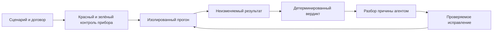

# Приложенная идея: измерять поведение, сохранять историю, замыкать обратную связь

Дата проверки: 2026-09-23. [Исходное вложение](inputs/runtime-metrics-idea.txt),
[происхождение и SHA-256](inputs/README.md). Текст прочитан полностью.
Ниже отдельно: что проверено по первоисточникам; что видно в коде; наши предложения;
что ещё предстоит проверить. Это исследование, не новый обязательный стандарт AQK.

## 1. Что добавляет идея

Вложение предлагает перед реализацией вертикального сценария определить измеримые условия
приёмки, после — снять нагрузку/SQL/память, а результаты сохранять так, чтобы следующие агенты
видели цену уже работающих функций. Проблема взаимодействия функций названа правильно:
несколько отдельных успешных испытаний не доказывают поведение их совместной нагрузки.

Для AQK здесь два разных направления:

- **Сам AQK как CLI:** время запуска/анализа на корпусах разного размера, память, число
  файлов/процессов, полнота обхода, доля ложных результатов, воспроизводимость свидетельства.
- **Проект-получатель AQK:** нагрузка API, SQL, очереди, пользовательские SLO и эксплуатация.
  Нужны профили конкретного приложения, а не обязательный Django/Celery/Prometheus в CLI.

Установка монитора сама по себе не является измеримым улучшением. Нужны чувствительный
прибор, известный плохой образец и понятное решение, принимаемое по показаниям.

## 2. Проверка терминов и чисел из вложения

| Утверждение | Результат проверки и граница |
|---|---|
| RED: Rate, Errors, Duration | Соответствует описанию автора метода; смотреть поток запросов, ошибки и длительности. [Grafana, выступление Tom Wilkie](https://grafana.com/files/grafanacon_eu_2018/Tom_Wilkie_GrafanaCon_EU_2018.pdf) |
| USE: Utilization, Saturation, Errors | [Метод Brendan Gregg](https://www.brendangregg.com/usemethod.html) начинается с списка ресурсов. Saturation относится к неудовлетворённому спросу/очереди, а не просто высокому CPU. Неизмеренное надо оставлять неизвестным |
| Четыре golden signals | В [Google SRE](https://sre.google/sre-book/monitoring-distributed-systems/) это latency, traffic, errors, saturation. HTTP 200 ещё не доказывает правильный ответ; успешные и ошибочные запросы полезно различать |
| DORA — четыре метрики | Историческая модель. [Текущая страница DORA](https://dora.dev/guides/dora-metrics/) перечисляет **пять**: change lead time, deployment frequency, failed deployment recovery time, change fail rate, deployment rework rate. Это свойства поставки приложения/сервиса, не оценка отдельного агента |
| 99.9% означает 43 минуты простоя в месяц | Для временного SLI и ровно 30 суток: `30 × 24 × 60 × 0.001 = 43.2` минуты. Это наш арифметический расчёт. При SLI по запросам бюджет считается в запросах, а не автоматически переводится в минуты; пример такого бюджета есть у [Google SRE](https://sre.google/workbook/error-budget-policy/) |
| После исчерпания бюджета все фичи останавливаются | [Документ Google](https://sre.google/workbook/error-budget-policy/) — **пример политики** для конкретного сервиса, с окном и исключениями, в том числе для срочных/security исправлений. Для нашего проекта политику нужно определить, а не выводить автоматически из трёх букв SLO |
| ISO/IEC 25010 имеет восемь характеристик | [ISO/IEC 25010:2023](https://www.iso.org/standard/78176.html) описывает **девять** характеристик. Открытая карточка проверена; полный платный текст стандарта не прочитан |
| ISO 25010 — источник термина «нефункциональные требования» | Историческое утверждение не подтверждено просмотренной карточкой ISO; не переносить в документацию как факт |
| OWASP Top 10 — десять самых частых уязвимостей | Формулировка слишком узкая. [Введение Top 10:2025](https://top10.owasp.org/2025/0x00_2025-Introduction/) описывает отбор критичных рисков по данным и опросу сообщества; это не просто сортировка частот |
| Awesome-списки всегда без отбора | Вложение не даёт доказательства для всего класса списков. Рассматривать конкретный список по его правилам отбора, актуальности и условиям применимости |

RED, USE и golden signals перекрываются, но задают разные вопросы. DORA относится к поставке,
а SLI/SLO — к наблюдаемому качеству услуги. Сведение всех чисел в общий «балл идеальности»
вложением не обосновано и для AQK не предлагается.

## 3. Уже имеющийся материал AQK: не начинать вторую независимую реализацию

Сверено входящее исследование
[2026-09-22 audit_project](../inbox/2026-09-22-audit-project-n-plus-one-and-ledger/README.md).
Полностью прочитаны README, 02-gates, 03-numbers и пять файлов реализации/тестов ниже.
01-incidents прочитан частично; оставшиеся файлы debt, logging-redaction и diagnostics не
выдаются здесь за полностью разобранные. Числа скорости из входящего отчёта — свидетельства
его автора; исходный сервер, commits и нагрузочные прогоны в этой сессии не воспроизводились.

| Файл | Что действительно реализовано | Предел |
|---|---|---|
| [route_ledger.py](../inbox/2026-09-22-audit-project-n-plus-one-and-ledger/code/route_ledger.py) | Список маршрутов от Django, наблюдение GET/2xx, форма пагинации, максимум строк, неизвестные маршруты, реестр долга | Только `api/v1/`, middleware и узнаваемая форма ответа; это не измеритель времени/SQL и не проверка всех бизнес-условий |
| [test_route_ledger.py](../inbox/2026-09-22-audit-project-n-plus-one-and-ledger/code/test_route_ledger.py) | Контроли «не вызван», «одна строка», «две», отличение карточки с results от пагинатора, debt-validation; настоящий APIClient в авторском тесте | Наличие этих тестов не означает, что мы запустили Django-проект; сам проект здесь не собран |
| [n_plus_one_gate.py](../inbox/2026-09-22-audit-project-n-plus-one-and-ledger/code/n_plus_one_gate.py) | Принимает сигнал zeal; копит нарушение и роняет тест после вызова, чтобы catch приложения не погасил известное нарушение; ключ долга route/model/field | Не видит SQL вне ORM и HTTP-окна, не доказывает производительность фоновых задач |
| [test_n_plus_one_gate.py](../inbox/2026-09-22-audit-project-n-plus-one-and-ledger/code/test_n_plus_one_gate.py) | View без select_related и исправленный вариант на двух Permission; исключение только своего маршрута; плохие записи долга; храповик | Сам детектор zeal не разобран; интеграционный прогон этого набора здесь не выполнялся |
| [full_suite.py](../inbox/2026-09-22-audit-project-n-plus-one-and-ledger/code/full_suite.py) | Общий `TEST_FULL_SUITE=1`, печать отказа и exitstatus=1 | Переменная — заявление вызывающей стороны. Этот файл сам не проверяет отсутствие `-k`, deselect или потерянного worker |

Полезное ядро: измерять не только «нарушений не было», но и **были ли созданы условия,
в которых прибор мог увидеть нарушение**. Ноль находок на пустом наборе данных не доказывает
отсутствия N+1. Для списка нужны минимум несколько объектов; разные связи и несколько размеров
набора нужны для более сильного испытания. Две строки — нижняя граница полезной фикстуры,
не доказательство поведения при 5000 пользователях.

Обнаруженные чтением ограничения, которые надо закрыть в пилоте:

1. `route_ledger.rows_in` узнаёт только list или словарь с подмножеством четырёх ключей
   пагинатора. Дополнительный ключ в обёртке переводит ответ в «не список». Это известная
   область действия, а не универсальное определение list-endpoint. Ожидаемую форму лучше
   сверять с контрактом, а не выводить только из фактически пришедшего ответа.
2. Форма списка узнаётся по успешному ответу. Ошибочная реализация, всегда отдающая объект
   вместо списка с HTTP 200, может пройти часть «вызвана». Арбитр схемы нужен отдельно.
3. Состояние `_seen`/`_state` хранится в памяти процесса; агрегации worker в прочитанных файлах
   нет. Это задача для проверки перед xdist/несколькими процессами, не заявление о поломке
   конкретного авторского конвейера, конфигурацию которого мы не запускали.
4. Неразобранное сообщение zeal в `_on_detected` сразу бросает NPlusOneError, в отличие от
   известных нарушений, которые копятся. Нужно проверить, не поглощает ли его широкий catch
   приложения — иначе изменившийся формат внешнего детектора может ослабить защиту.
5. `permanent` предотвращает ложный храповик на недетерминированном чужом коде. Однако
   постоянное исключение всё равно нуждается в пересмотре; отсутствие срабатывания не
   является доказательством исправления.
6. `_routes_of` использует приватный `URLResolver._join_route`. При переносе требуется
   версия Django и интеграционный контроль совпадения маршрутов, а не обещание переносимости
   практически без изменений на любой фреймворк.

В самом AQK [api-contract-has-arbiter/check.sh](../../kit/gates/api-contract-has-arbiter/check.sh)
опознаёт наличие арбитра и некоторые способы его ослабления. Это не runtime-журнал реально
полученных ответов. [evidence.mjs](../../tool/lib/evidence.mjs) различает named/silent/none
по направлению команды/выводу; это также не покрытие маршрутов и не LCOV.

## 4. Предлагаемый договор одного измерения

Это **наш проектный эскиз**, пока не реализованная схема AQK. Сначала один сценарий и один
арбитр, затем расширение при доказанной пользе.

| Группа | Что сохранять | Какую ошибку предотвращает |
|---|---|---|
| Идентичность | run_id, время начала/конца, commit и hash рабочего дерева, feature/scenario | Результат нельзя приписать другой версии кода |
| Проверка | Точная команда, конфиг, версии runtime/измерителя, hash тестовых данных | Смена прибора или фикстуры не маскируется под улучшение приложения |
| Нагрузка | Dataset/cardinality, профиль операций, concurrency или arrival rate, длительность, warm-up | «5000 пользователей» получает воспроизводимый смысл |
| Среда | CPU/RAM limits, число workers, БД/версия, кэш холодный/тёплый, фоновые задачи | Сравнение быстрой машины с медленной не выдаётся за эффект кода |
| Метрика | Имя, единица, тип, окно, число наблюдений, теги области, исходное распределение/счётчики | Не складываются несовместимые числа |
| Требование | Порог или допуск к baseline, причина, область применения | Порог не выбирается после получения результата |
| Вердикт | pass / fail / cannot / not-applicable и причина | Отсутствующие данные не становятся нулём ошибок |
| Доказательство | stdout/stderr, exit code, ссылка на raw artifact и hash | Можно проверить, что сказал прибор на самом деле |
| Сравнение | Совместимый baseline_run_id и перечисление отличий среды | Нельзя незаметно заменить базу удобным результатом |

`reports.md` удобен как представление для человека. Источником истины лучше сделать
неизменяемые структурированные результаты отдельных прогонов, а Markdown-оглавление строить
из них. Иначе параллельные агенты перезаписывают историю, теряются единицы и невозможно
проверить, к какому коммиту относилось число. Опыт с ограниченным fingerprint в
[code-quality](CODE-QUALITY-DEEP.md) показывает, почему provenance важнее красивой таблицы.

## 5. Почему общий отчёт нельзя получить простым сложением отчётов фич

**p95 не складываются и не усредняются.** [Prometheus](https://prometheus.io/docs/practices/histograms/)
объясняет, что готовые quantiles нельзя корректно агрегировать как обычные числа;
для совокупного распределения нужны исходные наблюдения либо совместимые histograms.

Наш вывод для предложенной системы:

- Сумма пиков RAM независимых запусков не равна пику совместной работы.
- Максимумы SQL или latency разных сценариев нельзя трактовать как измеренную общую нагрузку.
- Низкое среднее время не исключает длинного хвоста и ошибок.
- Результаты сравнимы только при согласованных окне, популяции и условиях.
- Для проверки взаимодействий нужен **отдельный смешанный сценарий**: реальные доли чтения/
  записи, фоновые задачи, ограниченные connection pools, удержание памяти, разогрев кэша.

Отчёт по фичам помогает выбрать такой опыт и найти регрессию. Он не заменяет сам опыт.

## 6. Как сделать прибор чувствительным до подключения гейта

Предлагаемая матрица для пилота:

| Сценарий | Хороший контроль | Плохой контроль | Аварийный контроль |
|---|---|---|---|
| SQL на список | Подгрузка связей, несколько размеров/разные связанные объекты | Убрать prefetch/select_related так, чтобы число SQL росло с данными | Детектор не подключён или формат его сигнала изменён |
| API latency | Заранее выбранный workload проходит договор | Искусственная задержка в тестовом стенде превышает порог | Генератор нагрузки завершился раньше или не сделал запросов |
| RAM | Стабилизация при повторении сценария | Намеренное удержание объектов в тестовой реализации | Метрика отсутствует или измерялся другой процесс |
| Полнота маршрутов | Все обязательные сценарии реально вызваны | Удалить тест одного маршрута | Не вернулся один worker / неполная таблица маршрутов |
| Свежесть | Код/тест/конфиг совпадают с результатом | Изменить любой вход после прогона | Нет metadata или ссылка на артефакт не читается |
| Передача отказа | Нарушение даёт ненулевой итог CI | Подставить заведомо нарушенный порог | Погасить exit code оболочкой: обёртка обязана обнаружить несоответствие |

У [k6 thresholds](https://grafana.com/docs/k6/latest/using-k6/thresholds/) нарушение порога даёт
ненулевой exit code. [k6 checks](https://grafana.com/docs/k6/latest/using-k6/checks/) сами по себе
не заменяют критерий провала всего запуска; их можно связать с thresholds.
Прежде чем признать интеграцию работающей, испытать оба направления на собственном стенде.

Отдельная поправка к входящему 02-gates: запрет всех wall-clock измерений был бы ошибкой.
Для CPU-алгоритма полезен `thread_time`; для времени ожидания пользователем нужен прошедший
интервал. [Python time](https://docs.python.org/3/library/time.html) различает их:
`perf_counter` включает ожидание, `thread_time` считает CPU текущего потока и не включает sleep.
CPU-время не измеряет полностью асинхронную работу других потоков/процессов или задержку I/O.
Фраза «при любой нагрузке машины» слишком сильна даже для CPU-бенчмарка: повторяемость надо
измерить, а шум и допустимые условия назвать.

## 7. Замкнутый агентский цикл: что стоит брать

Предлагаемая последовательность:

Агенту полезно поручить объяснение регрессии, воспроизведение и предложение исправления.
Числа и итог порога должен вычислять прибор. Пропажа телеметрии — `cannot`, а не разрешение
публиковать улучшение. Нужны ограничение попыток, бюджет запуска и остановка повторяющегося
неуспеха с сохранённым контекстом. Это совпадает с существующей идеей AQK «готово = доказано».

Celery упомянут во вложении как возможная реализация мониторинга. Это не основание добавлять
его в AQK. Для первого опыта достаточно существующего тестового runner/CI конкретного проекта.
Автономное изменение прода здесь не проектируется и не выполняется.

Трассы, метрики и логи следует связывать по контексту задачи. [OpenTelemetry](https://opentelemetry.io/docs/concepts/signals/)
описывает их как разные сигналы. Слайд «трейсинг, не логи» не является доказательством, что логи
вообще не нужны или что база событий автоматически даёт распределённую трассировку.

## 8. Все 29 названий из вложения: ничего не потеряно

Ниже **очередь проверки**, а не перечень уже изученных стандартов. Группа/вопрос — наш способ
организовать дальнейший разбор. Где текущая версия и точные требования не проверены, не
переносим числа/уровни из вложения как факт и не придумываем ссылку по памяти.

| № | Материал | Вопрос к последующему разбору / статус |
|---:|---|---|
| 1 | The Twelve-Factor App | Какие требования применимы к CLI, а какие только к сервису? Полный текст в очереди |
| 2 | Beyond the Twelve-Factor App | Что добавляет к №1 и какой ценой? В очереди |
| 3 | Semantic Versioning | Сопоставить обещанную совместимость публичного CLI с существующими тестами; полный текст в очереди |
| 4 | Conventional Commits | Какие потребители формата реально есть в AQK? В очереди |
| 5 | Keep a Changelog | Не дублирует ли существующий журнал; в очереди |
| 6 | EditorConfig | Что уже держится настройками/арбитром; в очереди |
| 7 | OpenSSF Scorecard | [Официальное описание](https://openssf.org/scorecard/) проверено; исходники checks ещё не разобраны. Автоматический security-сигнал, не общий балл качества приложения |
| 8 | OpenSSF Best Practices Badge | [Репозиторий проекта](https://github.com/coreinfrastructure/best-practices-badge) подтверждает self-certification и passing/silver/gold; текущий полный список критериев не прочитан |
| 9 | SLSA | Проверена [структура tracks v1.2](https://slsa.dev/spec/v1.2/tracks); не смешивать source/build и не приписывать уровень AQK без подтверждения |
| 10 | CMMI | Проверить актуальную редакцию и область; историческое число уровней пока не переписываем |
| 11 | OWASP SAMM | Какие практики можно проверить, а что остаётся процессным решением? В очереди |
| 12 | BSIMM | Разделить наблюдаемую практику организаций и нормативное требование; в очереди |
| 13 | NIST SSDF / SP 800-218 | Сверить актуальный статус редакции и применимость; в очереди |
| 14 | ISO/IEC 25010 | Открытая карточка 2023 проверена; девять характеристик. Полный стандарт не прочитан |
| 15 | ISO/IEC 25012 | Полный разбор качества данных в очереди |
| 16 | Volere | Проверить шаблон требований против текущих SPEC/планов AQK; в очереди |
| 17 | OWASP Top 10 | Введение 2025 проверено; метод отбора не равен простой частоте; полный набор в очереди |
| 18 | OWASP ASVS | Подобрать проверяемые требования для приложения-получателя, не устанавливать весь набор в CLI; в очереди |
| 19 | CIS Benchmarks | Нужен конкретный продукт/версия и разделение ручных/автоматических проверок; в очереди |
| 20 | Refactoring Catalog | Разбирать по конкретной проблеме кода, не увеличивать число правил ради каталога; в очереди |
| 21 | GoF Design Patterns | Условия применимости и цена абстракций; в очереди |
| 22 | Enterprise Integration Patterns | Нужен ли такой класс интеграции нашим проектам; в очереди |
| 23 | Microservices Patterns | Не выводить необходимость микросервисов из наличия книги; в очереди |
| 24 | xUnit Test Patterns | Сопоставить с настоящими тестами/фикстурами; в очереди |
| 25 | DORA / Accelerate | Актуальная страница метрик проверена (пять); книга целиком не прочитана |
| 26 | AWS Well-Architected | Нужен профиль системы и арбитр каждого выбранного требования; в очереди |
| 27 | Thoughtworks Technology Radar | Проверить механизм adopt/trial/assess/hold, не импортировать модность инструментов; в очереди |
| 28 | Google SRE Book/Workbook | Проверены главы monitoring и пример error-budget policy; книги целиком не прочитаны |
| 29 | awesome-lists | Оценивать конкретные списки по отбору/поддержке, общее осуждение не доказано |

## 9. Приоритет адаптации после анализа

1. Прототип договора измерения: один сценарий, raw evidence и четыре состояния результата.
2. Проверка пригодности данных/области: сценарий реально выполнен, объём данных достаточен,
   полный прогон отличён от частичного.
3. Для web-проекта — связка route ledger + schema arbiter + SQL detector с красными образцами.
4. История прогонов с provenance и построением Markdown, не ручной свод чисел.
5. Смешанный нагрузочный сценарий для взаимодействий функций.
6. Только после этого автоматизация агентского разбора и выбор эксплуатации/хранилища.

Критерий пользы: известная регрессия ловится; хороший контроль проходит; ошибка прибора
не зелёная; результаты воспроизводимы; цена прогона приемлема. Ни один из этих пунктов
не считается выполненным только потому, что появился SKILL.md или файл отчёта.
